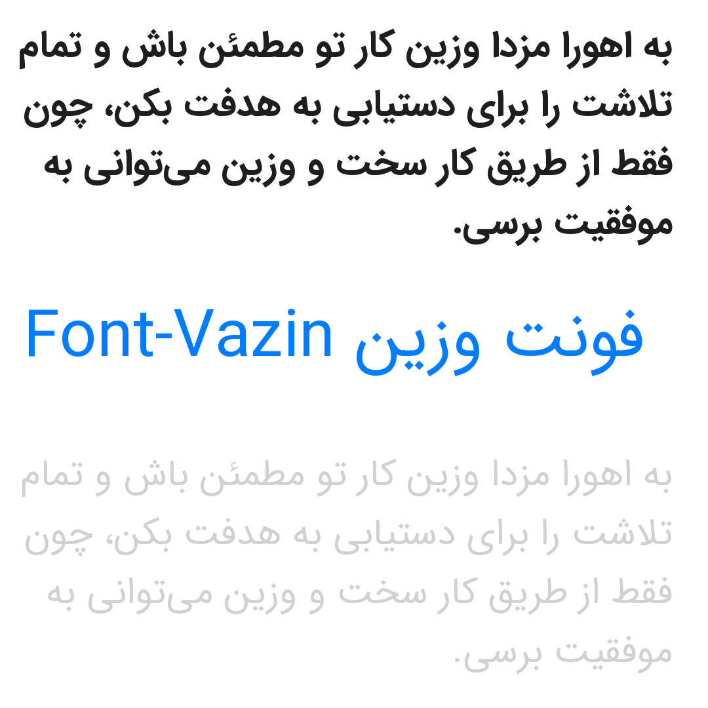

# Vazin font

## sample

[](https://github.com/vazin-team/vazin-font)

## how to use
You must install with package manager:

```bash
npm install vazin-font
yarn add vazin-font
```

link css:
```html
<link href="node_modules/vazin-font/dist/vazin-font-face.css" rel="stylesheet" type="text/css" />
```

use css
```css
*{
    font-family: 'Vazin', sans-serif;
}
```